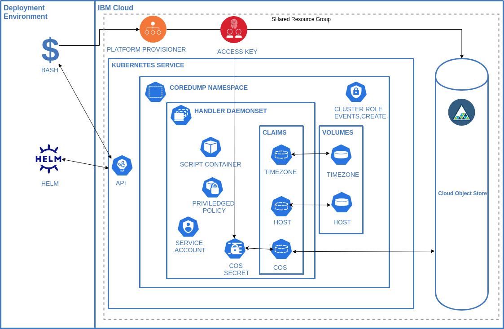

# Core Dump Handler

This helm chart is designed to deploy functionality that automatically saves core dumps from any public cloud kubernetes service provider or [RedHat OpenShift Kubernetes Service](https://cloud.ibm.com/kubernetes/catalog/create?platformType=openshift) to an S3 compatible storage service.

[](https://artifacthub.io/packages/search?repo=core-dump-handler) 
[](https://quay.io/repository/icdh/core-dump-handler)
[](https://github.com/ibm/core-dump-handler/actions)


## Code Of Conduct

We as members, contributors, and leaders pledge to make participation in our
community a harassment-free experience for everyone, regardless of age, body
size, visible or invisible disability, ethnicity, sex characteristics, gender
identity and expression, level of experience, education, socio-economic status,
nationality, personal appearance, race, religion, or sexual identity
and orientation.

We pledge to act and interact in ways that contribute to an open, welcoming,
diverse, inclusive, and healthy community.

[The full code of conduct is available here](./code-of-conduct.md)

## Prerequisites

The [Helm](https://helm.sh/) cli to run the chart

An [S3](https://en.wikipedia.org/wiki/Amazon_S3) compatible object storage solution such as [IBM Cloud Object Storage](https://cloud.ibm.com/objectstorage/create)

A [CRIO](https://cri-o.io/) compatible container runtime on the kubernetes hosts. If you service provider uses something else we will willingly recieve patches to support them.

## Installing the Chart

```
git clone https://github.com/IBM/core-dump-handler
cd core-dump-handler/charts/core-dump-handler
helm install core-dump-handler . --create-namespace --namespace observe \
--set daemonset.s3AccessKey=XXX --set daemonset.s3Secret=XXX \
--set daemonset.s3BucketName=XXX --set daemonset.s3Region=XXX
```

Where the `--set` options are configuration for your S3 compatible provider
Details for [IBM Cloud are available](https://cloud.ibm.com/docs/cloud-object-storage?topic=cloud-object-storage-uhc-hmac-credentials-main)

Details on all the available options are available on the [artifact hub](https://artifacthub.io/packages/helm/core-dump-handler/core-dump-handler) or in the [chart README](https://github.com/IBM/core-dump-handler/blob/main/charts/core-dump-handler/README.md).

## Public Cloud Kubernetes Service Compatibility

This is a matrix of confirmed test targets. Please PR environments that are also known to work

<table><thead><td>Provider</td><td>Product</td><td>Version</td><td>Validated?</td><td>Working?</td><td>Notes</td></thead>
<tr>
    <td>IBM</td><td>IKS</td><td>1.19-1.21</td><td>Yes</td><td>Yes</td><td></td>
</tr>
<tr>
    <td>IBM</td><td>ROKS</td><td>4.6</td><td>Yes</td><td>Yes</td><td>Must enable privileged policy <a href="#openshift">See OpenShift Section</a></td>
</tr>
<tr>
    <td>Microsoft</td><td>AKS</td><td>1.19</td><td>Yes</td><td>Yes</td><td></td>
</tr>
<tr>
    <td>Microsoft</td><td>ARO</td><td>4.6</td><td>Yes</td><td>No</td><td>ARO uses CoreOS and building compatable binaries seems to be the next step</td>
</tr>
<tr>
    <td>AWS</td><td>EKS</td><td>1.21</td><td>Yes</td><td>Yes*</td><td>Use --set daemonset.includeCrioExe=true</td>
</tr>
<tr>
    <td>AWS</td><td>ROSA</td><td>4.6</td><td>Yes</td><td>No</td><td>ROSA uses CoreOS and building compatable binaries seems to be the next step</td>
</tr>
<tr>
    <td>Digital Ocean</td><td>K8S</td><td>1.21.5-do.0</td><td>Yes</td><td>Yes*</td><td>Use --set daemonset.DeployCrioConfig=true and --set daemonset.composerCrioImageCmd="images"</td>
</tr>
<tr>
    <td>Google</td><td>GKE</td><td>1.20.10-gke.1600</td><td>Yes</td><td>Yes</td><td><a href="https://cloud.google.com/kubernetes-engine/docs/concepts/node-images#ubuntu-variants">Ubuntu containerd image</a> work without additional config.
    cos_containerd image support requires --set daemonset.hostDirectory=/home/kubernetes/bin --set daemonset.coreDirectory=/home/kubernetes/cores.
    </td>
</tr>
</table>

### OpenShift

As the agent runs in privileged mode the following command is needed on OpenShift.
`-z` is the service account name and `-n` is the namespace.
```
oc adm policy add-scc-to-user privileged -z core-dump-admin -n observe
```
Some OpenShift services such as OpenShift on IBM Cloud run on RHEL7 if that's the case then add the folowing option to the helm command or update the values.yaml.
This will be apparent if you see errors relating to glibc in the composer.log in the install folder of the agent. [See Troubleshooting below](#troubleshooting)
```
--set daemonset.vendor=rhel7
```

### Verifying the Chart Installation

Run a crashing container - this container writes a value to a null pointer

1. kubectl run -i -t segfaulter --image=quay.io/icdh/segfaulter --restart=Never

2. Validate the core dump has been uploaded to your object store instance.

## Background

[Core Dumps](https://en.wikipedia.org/wiki/Core_dump) are a critical part of observability.

As systems become more distributed core dumps offer teams a non-invasive approach to understanding why programs are malfunctioning in any environment they are deployed to. 

Core Dumps are useful in a wide number of scenarios but they are very relevant in the following cases:

- The process exits without a useful stack trace

- The process runs out of memory

- An application doesn’t behave as expected

The traditional problems with core dumps are: 

- Overhead of managing the dumps

- Dump Analysis required specific tooling that wasn't readily available on the developers machine.

- Managing Access to the dumps as they can contain sensitive information.

This chart aims to tackle the problems surrounding core dumps by leveraging common platforms (K8s, ROKS and Object Storage) in a cloud environment to pick up the heavy lifting.

## Chart Details

The chart deploys two processes: 

1. The **agent** manages the updating of `/proc/sys/kernel/*` configuration, deploys the composer service and uploads the core dumps zipfile created by the composer to an object storage instance. 
    
2. The **composer** handles the processing of a core dump and creating runtime, container coredump and image JSON documents from CRICTL and inserting them into a single zip file. The zip file is stored on the local file system of the node for the agent to upload.


When you install the IBM Cloud Core Dump Handler Helm chart, the following Kubernetes resources are deployed into your Kubernetes cluster:

- **Namespace**: A specific namespace is created to install the components into - defaults to ibm-observe

- **Handler Daemonset**: The daemonset deploys a [pod](./charts/core-dump-handler/templates/daemonset.yaml) on every worker node in your cluster. The daemonset contains configuration to enable the elevated process to define the core pattern  to place the core dump into object storage as well as gather pod information if available.

- **Privileged Policy**: The daemonset configures the host node so priviledges are required.

- **Service Account**: Standard Service account to run the daemonset

- **Volume Claims**: For copying the composer to the host and enabling access to the generated core dumps

- **Cluster Role**: Created with an **event** resource and **create** verb and associated with the service account. 

## Component Diagram
### Service Component Layout


### Permissions
To install the Helm chart in your cluster, you must have the **Administrator** platform role.

## Security implications
This chart deploys privileged kubernetes daemonset with the following implications: 

1. the automatic creation of privileged container per kubernetes node capable of reading core files querying the crictl for pod info. 

2. The daemonset uses hostpath feature interacting with the underlying Linux OS.

3. The composer binary is deployed and ran on the host server

4. Core dumps can contain sensitive runtime data and the storage bucket access must be managed accordingly.

5. Object storage keys are stored as secrets and used as environment variables in the daemonset

## Resources Required
The IBM Cloud Core Dump Handler requires the following resources on each worker node to run successfully:
- CPU: 0.2 vCPU
- Memory: 128MB

## Updating the Chart

1. Delete the chart. Don't worry this won't impact the data stored in object storage.
```
$ helm delete coredump-handler . --namespace observe
```
2. Ensure the persitent volume for`host-name` are deleted before continuing
```
$ kubectl get pv -n observe
```
3. Install the chart using the same bucket name as per the first install but tell the chart not to creat it. 
```
$ helm install coredump-handler . --namespace observe 
```

## Removing the Chart

```
helm delete coredump-handler -n observe
```

## Build and Deploy a Custom Version

The services are written in Rust using [rustup](https://rustup.rs/).

1. Build the image `docker build -t YOUR_TAG_NAME .`

2. Push the image to your container registry

3. Update the container in the `values.yaml` file to use it.

```yaml
image:
  repository: YOUR_TAG_NAME 
```
or run the helm install command with the `--set image.repository=YOUR_TAG_NAME`.

## Testing

1. Login to your kubernetes cluster so that `kubectl` can be ran from the script.

1. Ensure you have an minio client in your PATH on your machine.
    
    ```
    which mc
    /usr/local/bin
    ```
1. If you don't have an minio client it can be installed on linux with

    ```
    wget https://dl.min.io/client/mc/release/linux-amd64/mc
    chmod +x mc
    sudo cp mc /usr/local/bin/mc
    ```
    Other OSes are detailed here https://docs.min.io/docs/minio-client-quickstart-guide.html
    
1. Publish the container definition for this project to a registry 
   
   ```
   docker build -t REPOSITORYNAME:YOUR_TAG .
   docker push REPOSITORYNAME:YOUR_TAG
   ```
   
1. Modify the image definition in the yaml

    ```yaml
    image:
    repository: REPOSITORYNAME:YOUR_TAG 
    ```
1. In the root of the project folder create a file called `.env` with the following configuration

    ```
    S3_ACCESS_KEY=XXXX
    S3_SECRET=XXXX
    S3_BUCKET_NAME=XXXX
    S3_REGION=XXXX
    ```

1. Change directory to the integration folder and run the test

    ```
    cd integration
    ./run.sh
    ```


## Troubleshooting 

The first place to look for issues is in the agent console.
A successful install should look like this

```

[2021-09-08T22:28:43Z INFO core_dump_agent] Setting host location to: /var/mnt/core-dump-handler
[2021-09-08T22:28:43Z INFO core_dump_agent] Current Directory for setup is /app
[2021-09-08T22:28:43Z INFO core_dump_agent] Copying the composer from ./vendor/default/cdc to /var/mnt/core-dump-handler/cdc
[2021-09-08T22:28:43Z INFO core_dump_agent] Starting sysctl for kernel.core_pattern /var/mnt/core-dump-handler/core_pattern.bak
[2021-09-08T22:28:43Z INFO core_dump_agent] Created Backup of /var/mnt/core-dump-handler/core_pattern.bak
[2021-09-08T22:28:43Z INFO core_dump_agent] Starting sysctl for kernel.core_pipe_limit /var/mnt/core-dump-handler/core_pipe_limit.bak
[2021-09-08T22:28:43Z INFO core_dump_agent] Created Backup of /var/mnt/core-dump-handler/core_pipe_limit.bak
[2021-09-08T22:28:43Z INFO core_dump_agent] Starting sysctl for fs.suid_dumpable /var/mnt/core-dump-handler/suid_dumpable.bak
[2021-09-08T22:28:43Z INFO core_dump_agent] Created Backup of /var/mnt/core-dump-handler/suid_dumpable.bak
[2021-09-08T22:28:43Z INFO core_dump_agent] Created sysctl of kernel.core_pattern=|/var/mnt/core-dump-handler/cdc -c=%c -e=%e -p=%p -s=%s -t=%t -d=/var/mnt/core-dump-handler/core -h=%h -E=%E
kernel.core_pattern = |/var/mnt/core-dump-handler/cdc -c=%c -e=%e -p=%p -s=%s -t=%t -d=/var/mnt/core-dump-handler/core -h=%h -E=%E
kernel.core_pipe_limit = 128
[2021-09-08T22:28:43Z INFO core_dump_agent] Created sysctl of kernel.core_pipe_limit=128
fs.suid_dumpable = 2
[2021-09-08T22:28:43Z INFO core_dump_agent] Created sysctl of fs.suid_dumpable=2
[2021-09-08T22:28:43Z INFO core_dump_agent] Creating /var/mnt/core-dump-handler/.env file with LOG_LEVEL=info
[2021-09-08T22:28:43Z INFO core_dump_agent] Executing Agent with location : /var/mnt/core-dump-handler/core
[2021-09-08T22:28:43Z INFO core_dump_agent] Dir Content []
```

If the agent is running successfully then there may be a problem with the composer configuration.
To check the logs for the composer open a shell into the agent and cat the composer.log to see if there are any error messages.

```
cat /var/mnt/core-dump-handler/composer.log
```

If there are no errors then you should change the default log from `error` to `debug` in the values.yaml and redeploy the chart.
Create a core dump again and `/var/mnt/core-dump-handler/composer.log` should contain specific detail on each upload.
