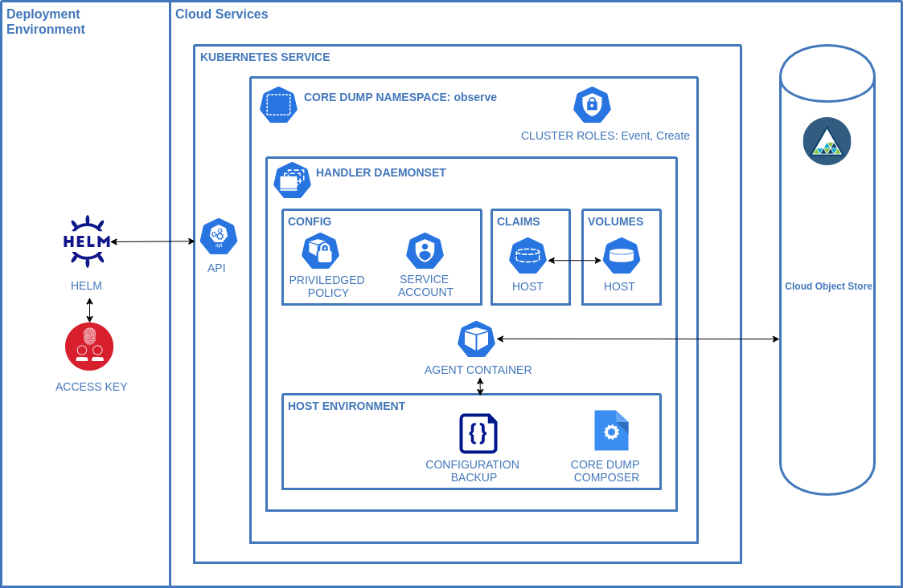

# IBM Core Dump Handler

This helm chart is designed to deploy functionality that automatically saves core dumps from any public cloud kuberenetes service provider or [RedHat OpenShift Kubernetes Service](https://cloud.ibm.com/kubernetes/catalog/create?platformType=openshift) to an S3 compatible storage service.

## Introduction

[Core Dumps](https://en.wikipedia.org/wiki/Core_dump) are a critical part of observability.

As systems become more distributed core dumps offer teams a non-invasive approach to understanding why programs are malfunctioning in any environment they are deployed to. 

Core Dumps are useful in a wide number of scenarios but they are very relevant in the following cases:

- The process exits without a useful stack trace

- The process runs out of memory

- An application doesn’t behave as expected

The traditional problems with core dumps are: 

- Overhead of managing the dumps

- Dump Analysis required specific tooling that wasn't readily available on the developers machine.

- Managing Access to the dumps as they can contain sensitive information.

This chart aims to tackle the problems surrounding core dumps by leveraging common platforms (K8s, ROKS and Object Storage) in a cloud environment to pick up the heavy lifting.

## Chart Details

The chart deploys two processes: 

1. The **agent** manages the updating of `/proc/sys/kernel/*` configuration, deploys the composer service and uploads the core dumps zipfile created by the composer to an object storage instance. 
    
2. The **composer** handles the processing of a core dump and creating runtime, container coredump and image JSON documents from CRICTL and inserting them into a single zip file. The zip file is stored on the local file system of the node for the agent to upload.


When you install the IBM Cloud Core Dump Handler Helm chart, the following Kubernetes resources are deployed into your Kubernetes cluster:

- **Namespace**: A specific namespace is created to install the components into - defaults to ibm-observe

- **Handler Daemonset**: The daemonset deploys a [pod](./charts/templates/daemonset.yaml) on every worker node in your cluster. The daemonset contains configuration to enable the elevated process to define the core pattern  to place the core dump into object storage as well as gather pod information if available.

- **Privileged Policy**: The daemonset configures the host node so priviledges are required.

- **Service Account**: Standard Service account to run the daemonset

- **Volume Claims**: For copying the composer to the host and enabling access to the generated core dumps

- **Cluster Role**: Created with an **event** resource and **create** verb and associated with the service account. 

## Component Diagram


## Prerequisites

The [Helm](https://helm.sh/) cli to run the chart

An [S3](https://en.wikipedia.org/wiki/Amazon_S3) compatible object storage solution such as [IBM Cloud Object Storage](https://cloud.ibm.com/objectstorage/create)

A [CRIO](https://cri-o.io/) compatible container runtime on the kubernetes hosts. If you service provider uses something else we will willingly recieve patches to support them.

### Permissions
To install the Helm chart in your cluster, you must have the **Administrator** platform role.

## Security implications
This chart deploys privileged kubernetes daemonset with the following implications: 

1. the automatic creation of privileged container per kubernetes node capable of reading core files querying the crictl for pod info. 

2. The daemonset uses hostpath feature interacting with the underlying Linux OS.

3. The composer binary is deployed and ran on the host server

4. Core dumps can contain sensitive runtime data and the storage bucket access must be managed accordingly.

5. Object storage keys are stored as environment variables in the daemonset

## Resources Required
The IBM Cloud Core Dump Handler requires the following resources on each worker node to run successfully:
- CPU: 0.2 vCPU
- Memory: 128MB

## Installing the Chart

```
git clone https://github.com/IBM/core-dump-handler
cd core-dump-handler/charts
helm install core-dump-handler . --namespace observe \
--set daemonset.s3AccessKey=XXX --set daemonset.s3Secret=XXX \
--set daemonset.s3BucketName=XXX --set daemonset.s3Region=XXX
```

Where the `--set` options are configuration for your S3 compatible provider
Details for [IBM Cloud are available](https://cloud.ibm.com/docs/cloud-object-storage?topic=cloud-object-storage-uhc-hmac-credentials-main)

### Verifying the chart installation

1. Create a container 
```
$ kubectl run -i -t busybox --image=busybox --restart=Never
```
2. Login to the container
```
$ kubectl exec -it busybox -- /bin/sh
```
3. Generate a core dump by sending SIGSEGV to the terminal process.
```
# kill -11 $$
```
4. View the core dump tar file in the configured Cloud Object Store service instance.

## Updating the chart

1. Delete the chart. Don't worry this won't impact the data stored in object storage.
```
$ helm delete coredump-handler . --namespace observe
```
2. Ensure the persitent volume for`host-name` are deleted before continuing
```
$ kubectl get pv -n observe
```
3. Install the chart using the same bucket name as per the first install but tell the chart not to creat it. 
```
$ helm install coredump-handler . --namespace observe 
```

## Removing the chart

```
helm delete coredump-handler -n observe
```

## Building the image.

[](https://quay.io/repository/number9/core-dump-handler)

The services are written in Rust using [rustup](https://rustup.rs/) and currently only support building on Linux.

1. Build the binaries `cargo build --release`

2. Build the image `docker build -t yourtagname .`

3. Update the container in the `values.yaml` file to use it.